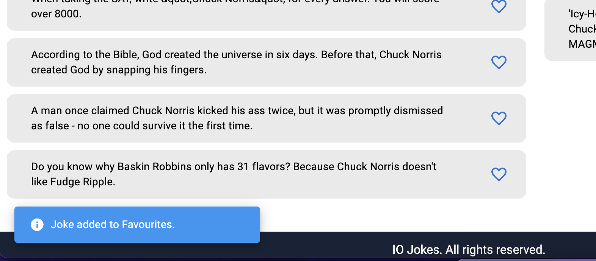

## jokes
# IODigital Assignment

### Illustration of end result

## Problem Statement 
Create a very cool Client Application  

We as developers like Chuck Norris jokes. Therefore we created the following assignment to test your Frontend skills/ knowledge. Please create a git repo before you start this assignment. When committing please give a proper description to explain your choices. 

- It should at least run in chrome (so you can use es6). 

- Please don't use any boilerplates. 

- You can/may use any framework/lib you want. 

- When finished, send a link of the repo.

## Requirements

We want to have an Application where we can fetch 10 Random Chuck Norris jokes. These jokes can be fetched from the following API http://api.icndb.com/jokes/random/10. 

When these jokes are fetched via a button they need to be displayed in a list. 

In this list we can mark certain jokes as favourites. 

The favourite jokes will appear in a favourites list with a max of 10 (unique) items. 

There should be an option to remove jokes from the favourite list as well. 

On refresh the favourites lists should be maintained.

We can also turn on/off a timer via a button (every 5 seconds) who will add one random joke to the favourites list http://api.icndb.com/jokes/random/1 until the list has 10 items

## Solution
After basic analysis I have decided to use ReactJs framework for solving above usecase. 

## Features
- Fetch Chuck Norris random jokes
- Favourite maximum 10 jokes to Favourites panel
- Remove joke from favourite
- Feature to enable or disable Auto fill of favourites bucket with random jokes after every 5 seconds
- Store / maintain state of favourited jokes in localstorage
- Notification for all activities
- Responsive UI to view on small screens

# Code Structure
Initiated application using npm
`npm init -y`

Using simple basic react native folder structure initiated application using 
-src
     App.js
    -assets             -> static resources images, css
    -pages              -> Landing page / any page which is front facing to user 
        Jokes.js
        ...
    -components         -> Pure components / Smart Components
    -libs               -> libs for utility modules
        -api            -> API / Service integration for application 
        -hooks          -> Hooks used within application 
        -utils          -> folder to keep all basic utiility functions, constants etc.

## Installation
- Checkout 
SSH - `git clone git@github.com:rishanimates/jokes.git`
https - `git clone https://github.com/rishanimates/jokes.git`
- Install dependancies 
`npm install`
- Start webpack application
`npm run start`
- Run Unit tests
`npm run test`

### GET Routes

- visit http://localhost:8080

## Screenshots
# First Loading

# Add to Favourite

# Auto fetch joke

# Notifications 
